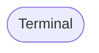

## Diagramas

**Elipse:** Demarca os símbolos de inicio e fim de um algoritmo

**Paralelograma:** Representa a saída ou entrada de dados mostrando os dados 

**Setas:** Indica o fluxo ou direção dos passos do algoritmo

**Retângulo:** Utilizado para um passo ou operação do algoritmo de qualquer natureza

**Losango:** Utilizado para validar uma condição, definindo para onde o algoritmo vai seguir dependendo dela.

### Exemplo de diagrama

