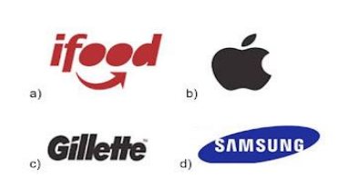
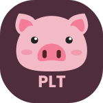

## Atividade Design Digital - Aula 03

### Participantes

- **Gabriel Menezes da Silva – RA:  1131392423017**
- **Enzo Luz Granato Barbosa – RA: 1131392423008**

### Perguntas

**1. Como a comunicação visual é definida?**

A comunicação visual é uma forma de transformar elementos visuais sejam eles, vídeos, desenhos, infográficos, logotipos, logomarcas, etc. Onde com certos padrões como paleta de cores, tipografia, icones seja possível reconhecer fácilmente algo. É enviar uma mensagem ou informação de forma visual.

**2. Qual imagem abaixo é considerada apenas uma logomarca?**

**B**: A letra b é a correta, visto que todas as outras contém também logotipos que é a representação da marca pelo seu nome.

**3. A comunicação visual é um modo de levar informação para as pessoas. Quais ferramentas podem ser utilizadas para a sua criação?**

Do ponto de vista de software temos diversas ferramentas como Photoshop, Figma, CorelDraw, Paint, Canva, etc.

Porém nada impede de ser feito  de uma forma física como a criação de um quadro em uma tela, ou um desenho em uma folha A4.

**4. Null Pointer Exception**

**5. Com  o  passar  do  tempo,  a  logomarca  envelhece,  devendo  ser  renovada.  Por  que  essa  renovação  é recomendada?**

- Conforme a sociedade evolui muda-se a cultura, sendo necessário uma modernização
- O público alvo e a mensagem que a marca quer passar pode mudar, por motivos de expansão para se adaptar a cultura de outros países por exemplo, motivos legais, ou uma mudança interna na própria empresa seja por decisão de estratégia ou fusão com uma outra empresa.

**6. Oque é um Designer?**
O profissional responsável por projetar, planejar e criar através de elementos visuais um significado e/ou identidade para algo ou alguém que possa ser reproduzível em série, ou seja um design.

**7. Porque a apresentação de um produto através de logomarca é importante?**

- [ ] Para que o produto saia do papel e se torne real.
- [ ] Para que o produto possua um design simples e elegante.
- [ ] Para que o produto seja apenas competitivo.
- [X] Para que o produto seja conhecido no mercado.

**8. Agora chegou o momento de você criar o seu produto e a sua logomarca. Para isso, siga as orientações abaixo:**

**a) Que produto é esse? Para que serve?**

O produto é o *Pig Latin Translator*, ele serve para traduzir do inglês para *Pig Latin* e vice-versa.

**b)  Faça com criatividade a logomarca que representa seu produto.**

