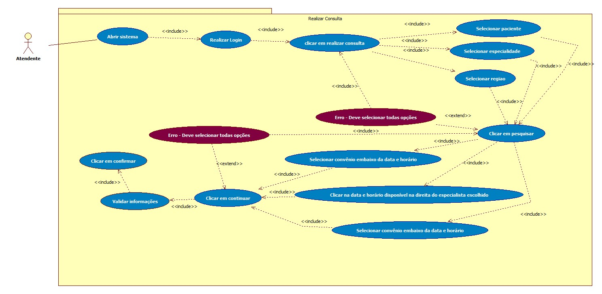

# Prova

## 1. No contexto da modelagem de casos de uso, oque são os atores e quais suas atribuições?
Os atores no caso de uso iniciam alguma ação e não necessariamente são humanos, eles podem ser sistemas externos como um captcha, algum dispositivo externo que da gatilho em alguma ação, ou qualquer coisa que interaja com o sistema(que não seja ele mesmo). O trabalho deles é iniciar o casos de uso, enviar entradas para o sistema e recebr as saídas que podem ser positivas ou uma exceção. Um exemplo é um usuário que inicia um login ele inicia o caso de uso precisa fornecer as entradas(usuário e senha) e recebe a saída que é um login bem sucedido ou um erro.

## 2. Ainda no contexto da modelagem de casos de uso, como o relacionamento de inclusão (include) se difere do relacionamento de extensão (extend) entre os casos de uso de um sistema?
O relacionamento de inclusão é o fluxo principal do sistema para situações que só exigem uma opção, então se existisse um sistema sem exceção e que só houvesse uma opção para seguir em cada um dos passos não haverias extensões. Já as extensões servem para dois propósitos, o de indicar que existe uma exceção e o para indicar que existe mais de uma opção para se seguir.

## 3. Descreva (com suas próprias palavras) a importância e a função do relacionamento de generalização no cenário da modelagem de casos de uso?
A generalização é utilizada para representar classes que posteriormente serão transformadas em código, onde existem certas funcionalidades de uma etapa que podem ser reutilizadas por outras etapas. Por exemplo em um cartão de crédito, o pagamento em geral pode ter características tanto do pagamento com crédito, tanto do pagamento com débito e podemos reutilizar as caracteristicas da classe pai nas classes filhas.

## 4. Quais são as principais diferenças entre o fluxo básico (ou normal) e o fluxo alternativo (ou de exceção) na modelagem de casos de uso?
As principais diferenças e que o fluxo normal flui corretamente quando tudo da certo, o usuário coloca as entradas corretas, o sistema funciona corretamente, etc. o fluxo de exceção existe considerando que as coisas podem dar errado, oque é normal, um usuário pode digitar sua senha incorretamente, quando isso acontece ele não pode logar no site, então o fluxo de exceção dita oque vai acontecer nessa situação, que nesse caso seria receber uma mensagem de erro, pedindo para ele tentar novamente.

## 5. Considerando as frases abaixo, identifique/assinale (✓) quais afirmações estão incorretas.
( ) Em um diagrama de casos de uso, os fluxos das ações são sempre iniciados por um ator.

(✓) O ator nem sempre necessita de um retorno/resultado final.

(✓) Um sistema externo não pode ser considerado um ator em um diagrama de casos de uso.

(✓) Atores não podem se relacionar através de generalizações.

## 6. Baseando-se nos conceitos de diagramação e modelagem de casos de uso (aprendidos em aula e praticados experimentalmente através da ferramenta StarUML), elabore os diagramas de casos de uso correspondentes aos seguintes requisitos funcionais: Realizar Consulta e Emitir Atestado Médico. Nestes diagramas, especifique os atores, os casos de uso (ou ações) e suas respectivas relações e associações. É importante que os diagramas contemplem os fluxos básicos (ou normais) e alternativos de cada funcionalidade.

